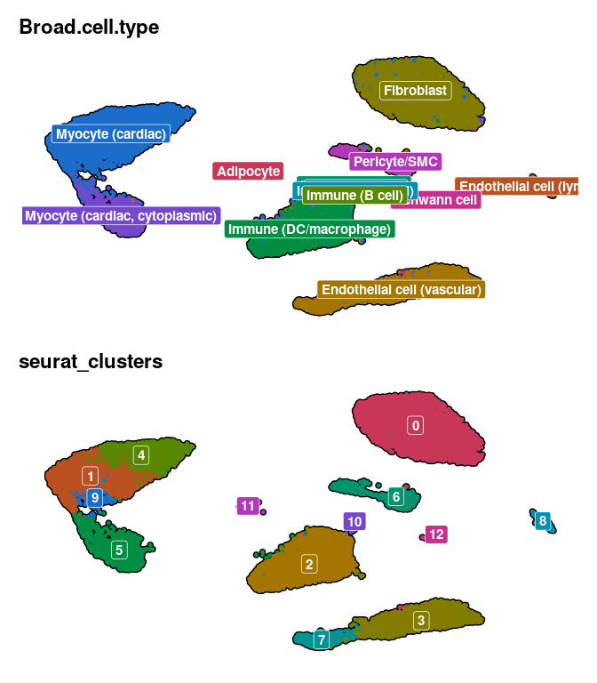
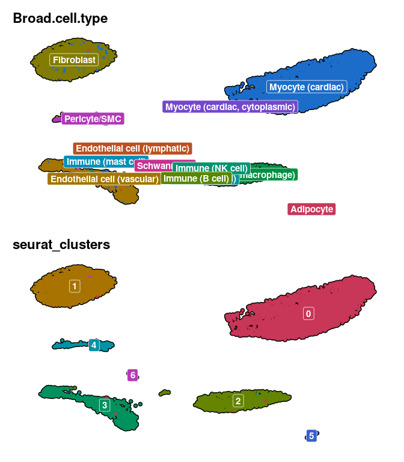
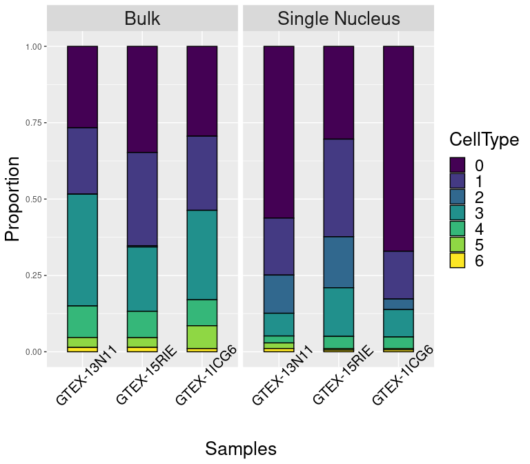
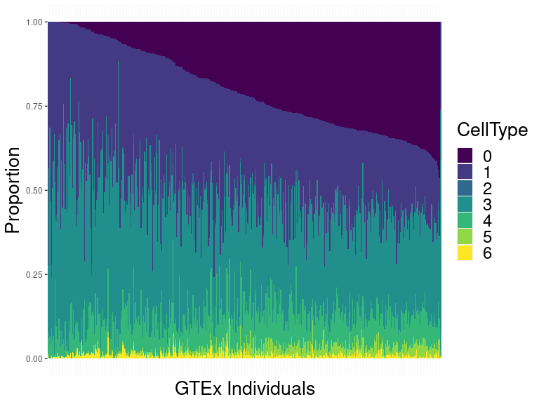

GTEx RNAseq Deconvolution
================
Brian Gural
4/10/2023

## Overview

The pipeline is currently divided into 3 portions:

**1_gtex_load.R**  
- Loads, cleans, and saves the snRNAseq and bulk RNAseq datasets  
- Accesses data by URL  
- Converts AnnData file to .H5Seurat file  

**2_gtex_de_genes.R**  
- Aggregates subject-matched single nucleus data into pseudo-bulk counts
matrices, then compares them to actual bulk.  
- Essentially, identifies differentially expressed genes between bulk
and single nucleus RNAseq  
- Can adjust several parameters including prefiltering of nuclei by RNA
count/features, mitocondrial/ribosomal gene content, and doublet tags.
Also can change log fold change threshold for DE and directionality
(i.e. greaterAbs, lessAbs, etc.)  
- Saves a seurat obj w/o DE genes

**3_gtex_decon.R**  
- Preforms bulk deconvolution on several hundred GTEx samples after
processing snRNAseq  
- Clusters snRNAseq, excludes clusters on adjustable criteria
(i.e. mitocondrial content, doublet scores, etc.), and repeats
clustering after exclusion of nuclei  
- Outputs stacked barcharts of composition estimates  

## Clustering and nuclei exclusion 

After loading our data and packages, we perform dimensional reduction
and exclude low-quality clusters:

``` r
# cluster and remove mito-heavy nuclei
sn.clust <- ClusterSeurat(gtex.sn, 
                              res = 0.2,
                              subset = T,
                              min.rna.ft = 200,
                              max.rna.ft = 2500,
                              min.rna.ct = 800,
                              max.mt.pt = 0.05,
                              max.rb.pt = 0.05,
                              scrublet_score  = 0.4,
                              nfeatures = 2000,
                              harmony = T,
                              regress.by = "batch")
```

The GTEx data we’re using had been pre-annotated with cell types (fine
and broad), so we can overlay those labels to get an idea of what cell
types we’re looking at:

<!-- -->

We can also look for poor quality clusters by overlaying mitocondrial
and ribosome transcript proportions:

<!-- -->

To quantify this, we’re going to look at how many nuclei in each cluster
contain more than 1% mitocondrial RNA:

| Seurat Cluster |  % \>1% mt |
|:---------------|-----------:|
| 0              |  8.4715849 |
| 1              |  0.5064964 |
| 2              | 11.7454545 |
| 3              |  3.5633739 |
| 4              |  5.7458564 |
| 5              |  6.5972222 |
| 6              | 37.8947368 |
| 7              | 14.5593870 |
| 8              | 25.8278146 |
| 9              |  5.7142857 |
| 10             |  8.4210526 |

Now we’ll set a cutoff off 20% of nuclei within a cluster. Once we label
all of the nuclei in each mitocondrial cluster, we repeat the clustering
without those nuclei.

<!-- -->

<!-- -->

<!-- -->
